<!-- README.md is generated from README.Rmd. Please edit that file -->

# magicaxis

<!-- badges: start -->

[](https://github.com/asgr/magicaxis/actions)
<!-- badges: end -->

The goal of magicaxis is provide functions to make pretty axes (major
and minor) on scientific plots. Particularly effort is made on producing
nice log plot outputs. The core function produces pretty axis labelling
in a number of circumstances that are often used in scientific plotting.
There is a higher level interface to a generic plot function that will
usually produce nice plots, even without much though on the users part.

## Installation

You can install the released version of magicaxis from
[CRAN](https://CRAN.R-project.org) with:

``` r
install.packages("magicaxis")
```

And the development version from [GitHub](https://github.com/) with:

``` r
# install.packages("devtools")
devtools::install_github("asgr/magicaxis")
```

## Example

An example of using **magplot**:

``` r
library(magicaxis)
## basic example code
x=10^{1:9}
y=1:9
magplot(log10(x),y,unlog='x')
```


``` r
magplot(x,y,log='x')
```


``` r

#Not ideal to have two decades between major labels:

magplot(x,y,log='x',majorn=c(10,5))
```


``` r
magplot(x,y,log='xy',majorn=c(10,5,5,5),side=1:4)
```


``` r

#Sometimes it is helpful to focus on where most of the data actually is.
#Using a single value for xlim and ylim sigma clips the data to that range.
#Here a value of 2 means we only show the inner 2-sigma (2% to 98%) range.
#The 'auto' option allows magclip to dynamically estimate a clip value.

temp=cbind(rt(1e3,1.5),rt(1e3,1.5))
magplot(temp)
```

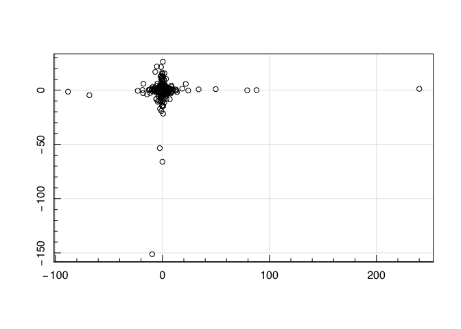

``` r
magplot(temp, xlim=2, ylim=2)
```

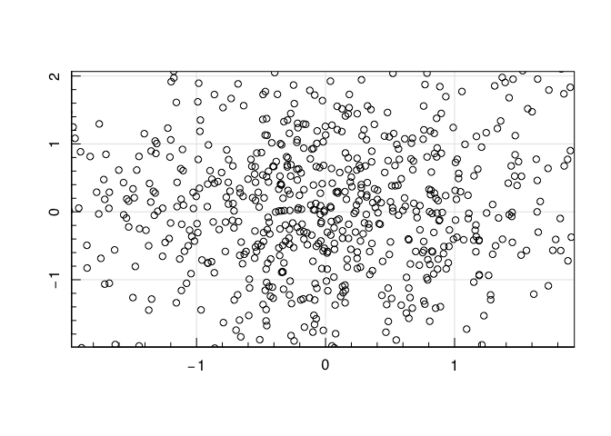

``` r
magplot(temp, xlim='auto', ylim='auto')
```

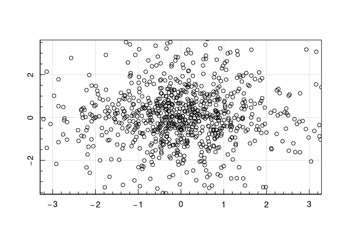

``` r

#Some astronomy related examples (and how to display the solar symbol):

temp=cbind(runif(10,8,12),runif(10,0,5))

magplot(temp[,1:2], xlab=expression(M['\u0298']), ylab=expression(M['\u0298']/Yr), unlog='xy')
```

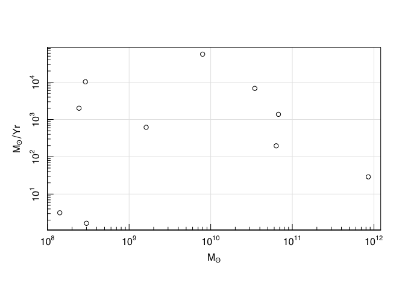

``` r

#With z scaling

z=sqrt(9:1)
magplot(x, y, z, log='x', position='topleft')
```


An example of using **maghist**:

``` r
maghist(rnorm(1e4))
#> [1] "Summary of used sample:"
#>     Min.  1st Qu.   Median     Mean  3rd Qu.     Max. 
#> -3.92436 -0.69188 -0.02302 -0.01677  0.66278  3.66035 
#> [1] "sd / MAD / 1-sig / 2-sig range:"
#> [1] 1.001466 1.006077 1.009919 1.982456
#> [1] "Using 10000 out of 10000"
```

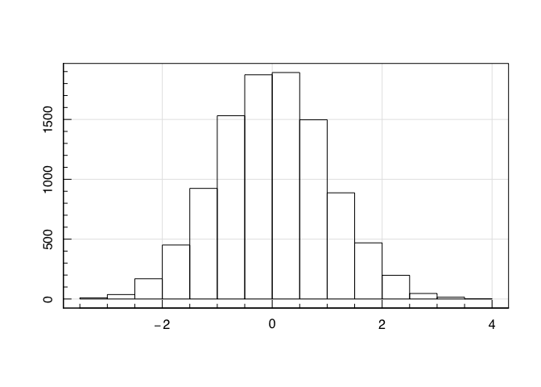

``` r
maghist(rnorm(1e4), xlim=c(-2,4))
#> [1] "Summary of used sample:"
#>     Min.  1st Qu.   Median     Mean  3rd Qu.     Max. 
#> -1.99754 -0.60632  0.02039  0.05656  0.67684  3.87627 
#> [1] "sd / MAD / 1-sig / 2-sig range:"
#> [1] 0.9382852 0.9477177 0.9575367 1.8775850
#> [1] "Using 9758 out of 10000 (97.58%) data points (242 < xlo & 0 > xhi)"
```


``` r

#Notice the x-limits are close to -3/3, since  if we ask for xlim=3 (a 3-sigma range)

maghist(rnorm(1e4), xlim=3, verbose = FALSE)
```

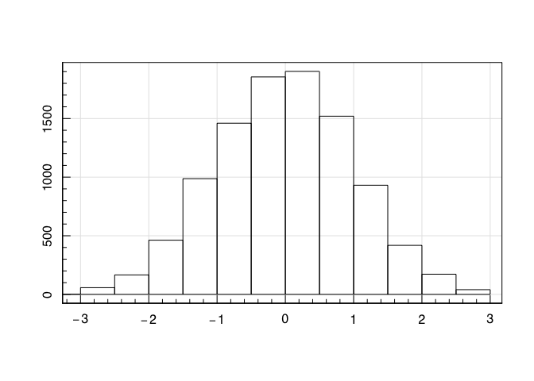

``` r

#The 'auto' option allows magclip to dynamically estimate a clip value (which is similar
#in this case, but need not be in general).

maghist(rnorm(1e4), xlim='auto', verbose = FALSE)
```


``` r

#Test of log histograms:

testdata=10^(runif(1e3,0,4))
maghist(testdata)
#> [1] "Summary of used sample:"
#>     Min.  1st Qu.   Median     Mean  3rd Qu.     Max. 
#>    1.005   10.666  108.729 1079.447 1063.772 9666.258 
#> [1] "sd / MAD / 1-sig / 2-sig range:"
#> [1] 2019.6296  158.3374 1248.4168 4045.0531
#> [1] "Using 1000 out of 1000"
```

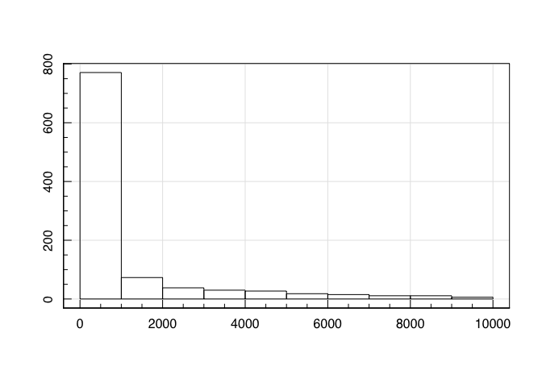

``` r
maghist(testdata,log='x')
#> [1] "Summary of used sample:"
#>     Min.  1st Qu.   Median     Mean  3rd Qu.     Max. 
#> 0.002284 1.028006 2.036161 2.003543 3.026847 3.985258 
#> [1] "sd / MAD / 1-sig / 2-sig range:"
#> [1] 1.163157 1.489855 1.407072 1.902096
#> [1] "Using 1000 out of 1000"
```


``` r
maghist(testdata,log='y')
#> [1] "Summary of used sample:"
#>     Min.  1st Qu.   Median     Mean  3rd Qu.     Max. 
#>    1.005   10.666  108.729 1079.447 1063.772 9666.258 
#> [1] "sd / MAD / 1-sig / 2-sig range:"
#> [1] 2019.6296  158.3374 1248.4168 4045.0531
#> [1] "Using 1000 out of 1000"
```


``` r
maghist(testdata,log='xy')
#> [1] "Summary of used sample:"
#>     Min.  1st Qu.   Median     Mean  3rd Qu.     Max. 
#> 0.002284 1.028006 2.036161 2.003543 3.026847 3.985258 
#> [1] "sd / MAD / 1-sig / 2-sig range:"
#> [1] 1.163157 1.489855 1.407072 1.902096
#> [1] "Using 1000 out of 1000"
```

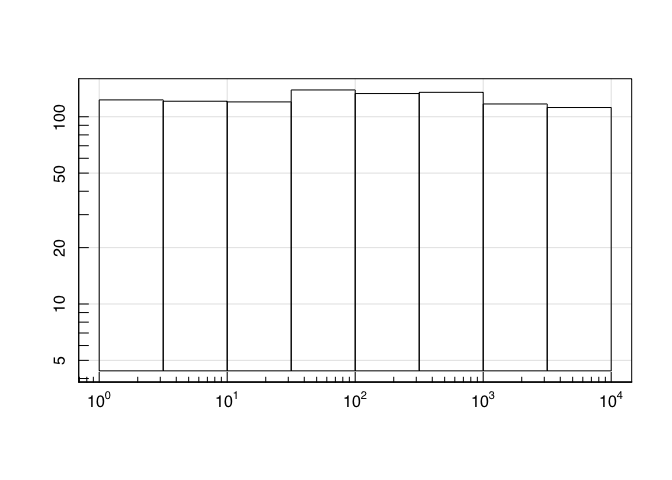

``` r

maghist(testdata,freq=FALSE)
#> [1] "Summary of used sample:"
#>     Min.  1st Qu.   Median     Mean  3rd Qu.     Max. 
#>    1.005   10.666  108.729 1079.447 1063.772 9666.258 
#> [1] "sd / MAD / 1-sig / 2-sig range:"
#> [1] 2019.6296  158.3374 1248.4168 4045.0531
#> [1] "Using 1000 out of 1000"
```

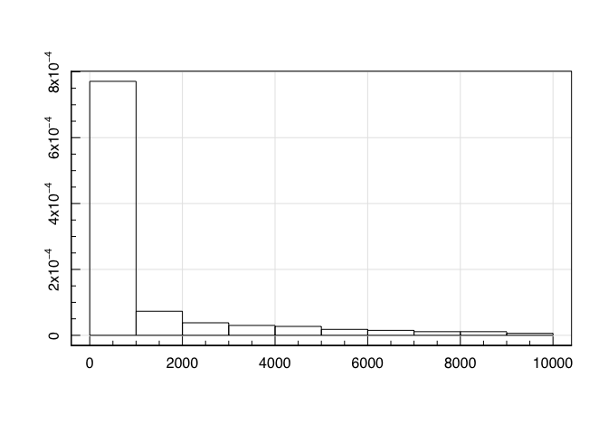

``` r
maghist(testdata,freq=FALSE,log='x')
#> [1] "Summary of used sample:"
#>     Min.  1st Qu.   Median     Mean  3rd Qu.     Max. 
#> 0.002284 1.028006 2.036161 2.003543 3.026847 3.985258 
#> [1] "sd / MAD / 1-sig / 2-sig range:"
#> [1] 1.163157 1.489855 1.407072 1.902096
#> [1] "Using 1000 out of 1000"
```

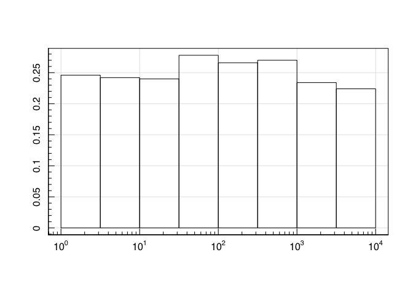

``` r
maghist(testdata,freq=FALSE,log='y')
#> [1] "Summary of used sample:"
#>     Min.  1st Qu.   Median     Mean  3rd Qu.     Max. 
#>    1.005   10.666  108.729 1079.447 1063.772 9666.258 
#> [1] "sd / MAD / 1-sig / 2-sig range:"
#> [1] 2019.6296  158.3374 1248.4168 4045.0531
#> [1] "Using 1000 out of 1000"
```

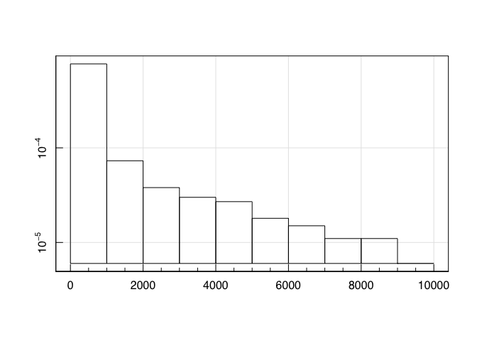

``` r
maghist(testdata,freq=FALSE,log='xy')
#> [1] "Summary of used sample:"
#>     Min.  1st Qu.   Median     Mean  3rd Qu.     Max. 
#> 0.002284 1.028006 2.036161 2.003543 3.026847 3.985258 
#> [1] "sd / MAD / 1-sig / 2-sig range:"
#> [1] 1.163157 1.489855 1.407072 1.902096
#> [1] "Using 1000 out of 1000"
```

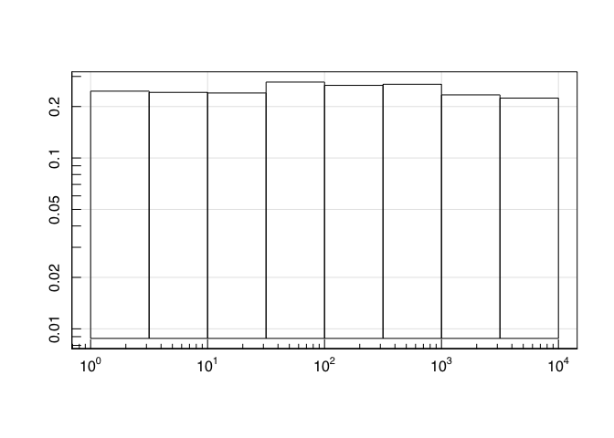

``` r

#Test of plotting histogram objects:

testhist=maghist(testdata,log='xy')
#> [1] "Summary of used sample:"
#>     Min.  1st Qu.   Median     Mean  3rd Qu.     Max. 
#> 0.002284 1.028006 2.036161 2.003543 3.026847 3.985258 
#> [1] "sd / MAD / 1-sig / 2-sig range:"
#> [1] 1.163157 1.489855 1.407072 1.902096
#> [1] "Using 1000 out of 1000"
```


``` r
maghist(testhist)
```

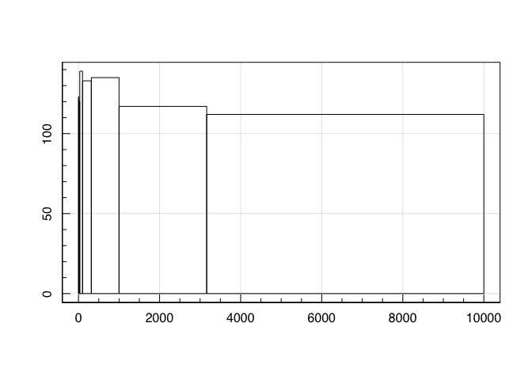

``` r
maghist(testhist,log='x')
```

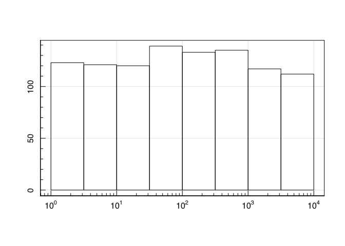

``` r
magplot(testhist,log='y')
```

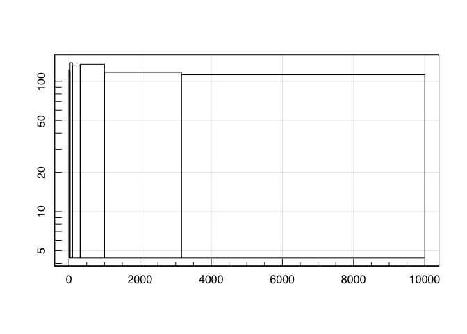

``` r
magplot(testhist,log='xy')
```


``` r

#Nice to see a grid with large ranges:

maghist(rnorm(1e6), grid=TRUE)
#> [1] "Summary of used sample:"
#>      Min.   1st Qu.    Median      Mean   3rd Qu.      Max. 
#> -4.768956 -0.674841 -0.001585 -0.000377  0.675271  5.050840 
#> [1] "sd / MAD / 1-sig / 2-sig range:"
#> [1] 1.000313 1.000866 1.000645 1.999022
#> [1] "Using 1000000 out of 1000000"
```

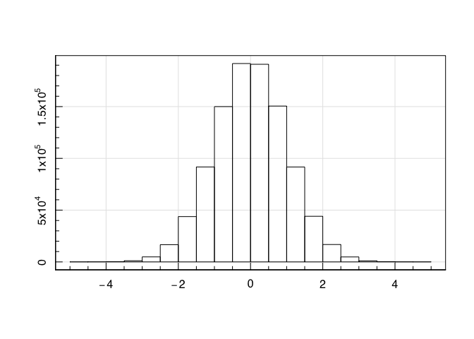

``` r
maghist(rnorm(1e6), log='y', grid=TRUE)
#> [1] "Summary of used sample:"
#>      Min.   1st Qu.    Median      Mean   3rd Qu.      Max. 
#> -5.060669 -0.675340 -0.000620  0.000524  0.675740  4.801969 
#> [1] "sd / MAD / 1-sig / 2-sig range:"
#> [1] 1.001899 1.001504 1.001384 2.004430
#> [1] "Using 1000000 out of 1000000"
```

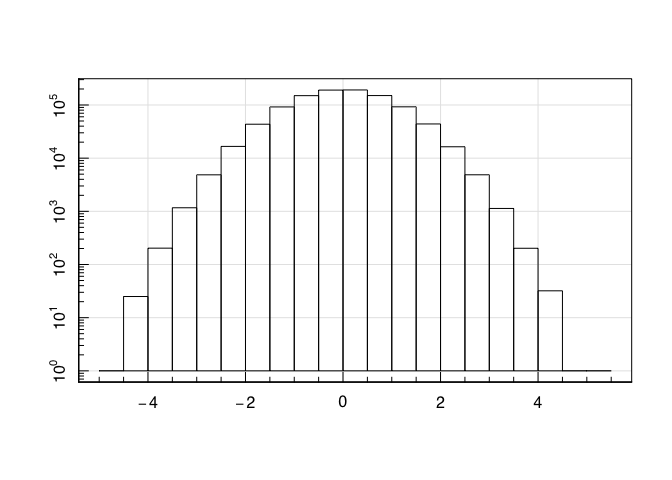

An example of using **magbin**:

``` r
set.seed(666)
xydata = cbind(rnorm(1e4), rnorm(1e4))
magbin(xydata, shape='hexagon') #default
```

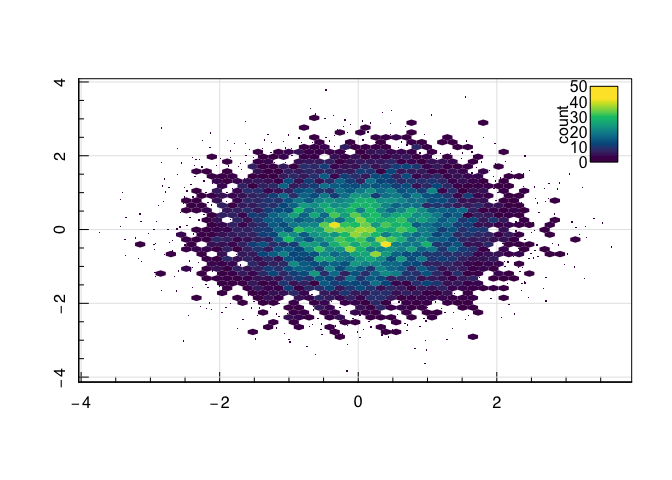

``` r
magbin(xydata, shape='square')
```


``` r
magbin(xydata, shape='triangle')
```


``` r
magbin(xydata, shape='trihex')
```


``` r
magbin(xydata, shape='hexagon', direction='v')
```


``` r
magbin(xydata, shape='triangle', direction='v')
```


``` r
magbin(xydata, shape='trihex', direction='v')
```


``` r
magbin(xydata, shape='hexagon', step=c(0.2,0.4)) #different aspect ratio hexagons
```


``` r

magbin(xydata, z=xydata[,1]^2-xydata[,2]^2, colref='zstat', sizeref='count')
```


``` r

magbin(xydata, z=xydata[,1]^2-xydata[,2]^2, colref='zstat', sizeref='count',
funstat=mad)
```


``` r
magbin(xydata, z=xydata[,1]^2-xydata[,2]^2, colref='zstat', sizeref='count',
funstat=function(x){quantile(x,0.9)})
```


``` r

xydata = cbind(10^rnorm(1e4), 10^rnorm(1e4))
magbin(xydata, log='xy')
```


``` r
magbin(xydata, z=xydata[,1]*xydata[,2], colref='zstat', sizeref='count',
log='xyz')
```


``` r
magbin(xydata, log='xy', unlog='xy', xlim=3, ylim=3)
```


